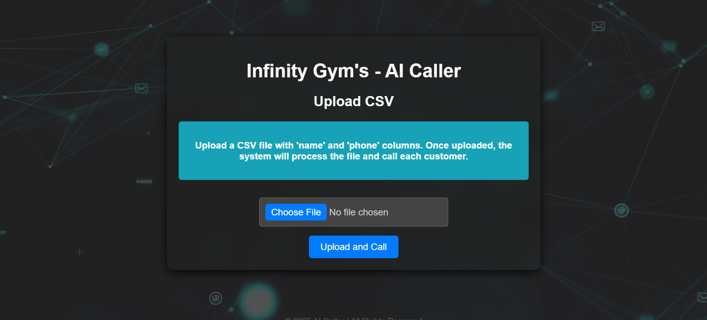
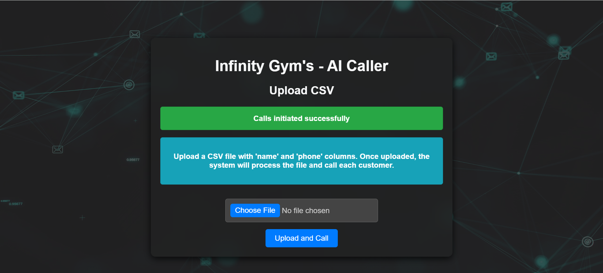

# Team-Infinity-IITG-AI-Caller
# Infinity Gym AI Caller 🤖📞

Welcome to the **Infinity Gym AI Caller** project! This web application leverages Twilio to make automated calls to potential customers from a CSV file. The AI engages in a conversation, convinces them to join Infinity Gym, and handles customer queries.

## Features 🎯

- **CSV Upload**: Upload a CSV file containing customer details.
- **Automated Calls**: The system makes automated calls to each customer.
- **Conversational AI**: The AI engages with customers, answering their queries and guiding them to join the gym.
- **Twilio Integration**: Uses Twilio to make calls and convert responses into speech.
- **Response Generation**: Generates personalized responses to customer queries.

## Folder Structure 📂

```plaintext
idamodhar17-team-infinity-iitg-ai-caller/
├── README.md               # Project documentation
├── app.yaml                # GCP app configuration
├── main.py                 # Main backend code
├── requirements.txt        # Python dependencies
├── .gcloudignore           # GCP ignore file
├── flask-app/              
│   ├── app.py              # Flask application
│   ├── static/             # Static assets (CSS, JS, images)
│   └── templates/          
│       └── index.html      # Frontend interface for uploading CSV
├── responses/             
│   └── response_generator.py # Script to generate responses
├── twilio/                 
│   ├── handle-interruption.js  # Handle call interruptions
│   ├── init-call.py            # Start the call
│   ├── make-call.js           # Make the call using Twilio
│   ├── partial-response.js    # Handle partial responses
│   ├── process-input.js       # Process customer input
│   ├── process-interest.js    # Determine customer interest
│   ├── process-response.js   # Process customer queries
│   └── voice-handler.js      # Convert text to speech for responses
└── uploads/                
    └── sample_customers.csv   # Sample customer data
```

## How to Use ⚙️

1. **Clone the Repository**:
    ```bash
    git clone https://github.com/yourusername/infinity-gym-ai-caller.git
    cd infinity-gym-ai-caller
    ```

2. **Set Up Environment**:
    Install the required dependencies by running:
    ```bash
    pip install -r requirements.txt
    ```

3. **Start the Flask App**:
    Run the Flask app locally to access the web interface:
    ```bash
    python flask-app/app.py
    ```

4. **Upload CSV File**:
    Navigate to the web interface (usually at `http://localhost:5000`) and upload a CSV file containing customer details (e.g., name, phone number).

5. **Start the Calling Process**:
    Once the file is uploaded, the system will begin making automated calls to each customer and engage in a conversation using Twilio.

## Technologies Used 🛠️

- **Twilio**: For voice call integration.
- **Amazon Polly**: For human like Text-to-Speech conversion.
- **Flask**: Lightweight Python web framework for the web app.
- **Python**: Backend logic for handling customer data and interactions.
- **JavaScript**: For managing call-related tasks in the Twilio integration.

## Screenshots 📸

### Web Interface for Uploading CSV


### Call in Progress


### Sample Response Generated by AI
[Sample Response (MP3)](sample-conversational-response/sample_response.mp3)